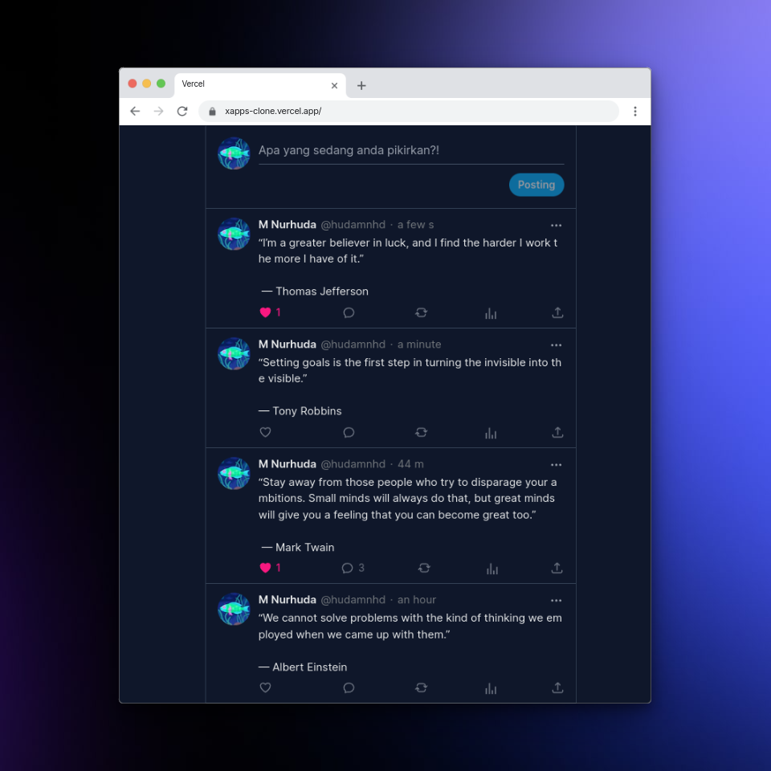

## Web Twitter Clone
Twitter clone ini di buat dengan [T3 Stack](https://create.t3.gg) base Next.js Pages directory.

Karena PlanetScale sudah tidak menyediakan layanan database gratis, jadi Project ini hanya
menggunakan sistem data cache saja supaya aplikasi demo tetap berjalan.

Didalam repository project ini memiliki 2 Branch:
- Branch main yaitu kode baru yang saya tulis ulang dengan Framework React Router v7.
- Branch nextjs yaitu kode lama yang menggukan beberapa Teknologi yang disebutkan dibawah.

### Fitur

- ✅ Authentikasi dengan google
- ✅ Interaktif postingan ( like, comment, and detail post by id )
- ✅ Following, Followers
- ✅ Profile view
- ✅ Responsive

### Links

- Repository: [github.com/hudamnhd/twitter-clone](https://github.com/hudamnhd/twitter-clone)
- Website: [xapps-clone.vercel.app](https://xapps-clone.vercel.app)

### Stack

1. **Next.js**: Next.js memiliki fitur SSR, routing yang memudahan ketika proses development .

2. **NextAuth.js**: NextAuth untuk menghandle authentikasi dengan google.

3. **Prisma**: Prima untuk mengatur database, ketika development saya menggukana sql lite sebagai database.

4. **PlanetScale**: Penyedia database gratis yang bisa di hubungkan dengan prisma.

5. **TRPC**: Pustaka yang memudakan komunikasi API antara client dan server (
   dikombinasikan dengan react tanstack query).

6. **Upstash**: Pustaka untuk caching data dan limitasi ( membatasi user hanya bisa menambakan data dalam waktu tertentu).
