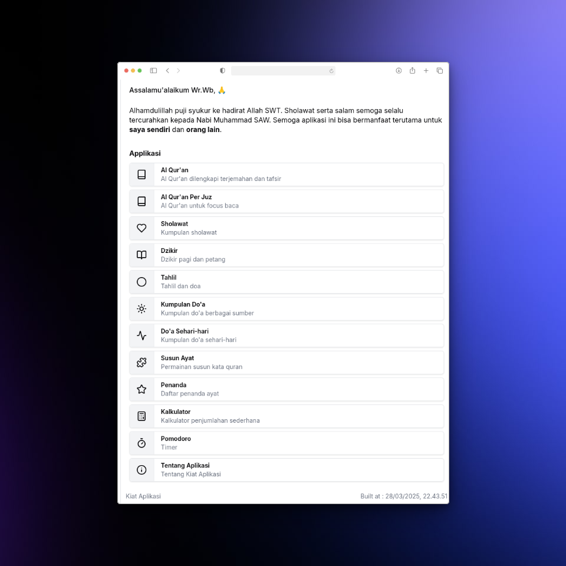

## Apa itu Kiat Web ?
Kiat Web adalah aplikasi baca quran untuk sehari-hari (terutama untuk diri sendiri).

Project ini dibuat dengan pustaka react vite dan di optimalkan supaya bisa mendukung fitur offline.

### Fitur Aplikasi

- ✅ Cepat dan ringan
- ✅ 3 tema (terang, sepia, gelap)
- ✅ Bisa offline
- ✅ Al Quran dengan berbagai sumber terjemahan dan tafsir
- ✅ Al Quran hafalan dan susun kata
- ✅ Pencarian kata di dalam terjemahan
- ✅ Doa-doa, Sholawat, dzikir dan tahlil
- ✅ Kalkulator sederhana untuk memudahan penjumlahan

### Links Aplikasi

- Repository: [github.com/hudamnhd/kiat](https://github.com/hudamnhd/kiat)
- Website: [kiat.netlify.app](https://kiat.netlify.app)

### Stack

- React: [https://react.dev](https://react.dev)
- React Router: [https://reactrouter.com](https://reactrouter.com)
- Vite: [https://vite.dev](https://vite.dev)
- Tailwind: [https://tailwindcss.com](https://tailwindcss.com)
